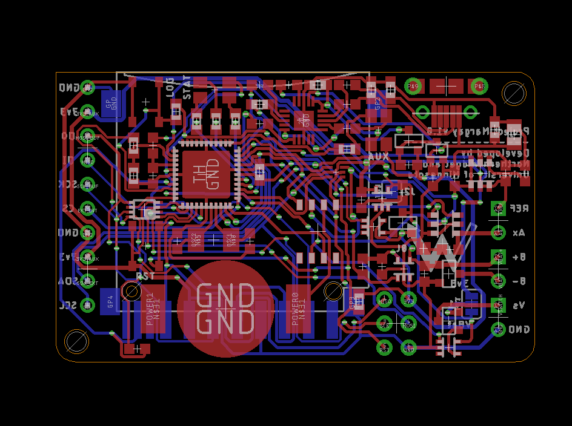

# Project Margay
Ultra low power digital data logger

## Inspiration:
Motivated my the goals of Elli Ronay at the University of Vanderbilt, she wanted to have a very compact data logger for monitoring stalagmite formation. Our previous loggers were very large to fit in her enclosure and had many features which she did not need. We helped her design a very early version of what became Project Margay. We looked at what features were most commonly needed, digital communication, occasional analog reading, and switching power for larger more powerful devices (in her case, a gas sensor with a heater coil). And of course on top of all of this, it needed to be low power, since if it needs a wad of 'D' batteries to run, being compact matters not. Through careful selection of the power topology and components, this has become the lowest power logger we have ever produced, capable of running for multiple years off of a set of just 3 AA batteries! 

## Features:
* SPI interface
* I2C interface
* Single 18 bit ADC
* On board thermistor and battery voltage monitoring
* Input voltage 3.3v ~ 5v (can run on 3 alkaline batteries)
* Sleep current ~ 2.5uA (Mrk 1.0)
* ATMEGA644P Micro controller 
* Full size SD for data storage and easy handling in the field 
* Dual RGB LEDs for status indication 
* Reverse polarity protected battery input 

### Status:
In development/production
* Current version: v1.0
* View on [GitHub](https://github.com/NorthernWidget-Skunkworks/Project-Margay)

## Namesake:
The [Margay (Leopardus wiedii)](https://en.wikipedia.org/wiki/Margay), is a small South American wild cat, weighing less than 5kg, but still a skilled and powerful hunter. Showing size is not an indicator for ability!

